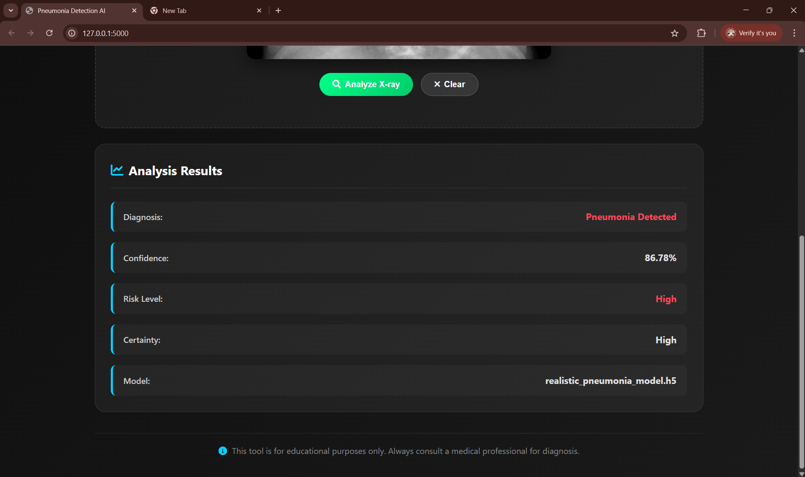

# Pneumonia Detection AI - Web Application

## Abstract

This project presents a comprehensive web-based pneumonia detection system that leverages deep learning to analyze chest X-ray images. The application combines a robust Flask backend with a modern, dark-themed frontend interface to provide an intuitive platform for medical image analysis.

The system utilizes a convolutional neural network (CNN) trained to classify chest X-ray images as either normal or showing signs of pneumonia. The web interface features drag-and-drop functionality, real-time image preview, and detailed prediction results including confidence scores and risk assessments.

**Key Features:**
- **Deep Learning Model**: CNN-based architecture for binary classification of chest X-rays
- **Modern Web Interface**: Dark-themed, responsive design with intuitive user experience
- **Real-time Analysis**: Instant image processing and prediction results
- **Comprehensive Results**: Confidence scores, risk levels, and certainty indicators
- **Cross-platform Compatibility**: Works on desktop, tablet, and mobile devices
- **Medical-grade UI**: Professional interface designed for healthcare applications

## Technology Stack

- **Backend**: Flask (Python web framework)
- **Machine Learning**: TensorFlow/Keras for model inference
- **Frontend**: HTML5, CSS3, JavaScript (Vanilla)
- **Image Processing**: PIL (Python Imaging Library)
- **Styling**: Modern CSS with gradients, animations, and responsive design

## Project Structure

```
├── app.py                              # Main Flask application
├── pneumonia_model.h5                  # Trained pneumonia detection model
├── realistic_demo_pneumonia_model.h5   # Demo model for testing
├── requirements.txt                    # Python dependencies
├── templates/
│   └── index.html                     # Main web interface
├── static/
│   ├── style.css                      # Dark theme styling
│   └── script.js                      # Interactive functionality
├── create_demo_model.py               # Script to create basic demo model
├── create_realistic_demo_model.py     # Script to create trained demo model
├── fix_model_compatibility.py         # Model compatibility fixer
└── README.md                          # Project documentation
```

## Installation & Setup

1. **Clone the repository**
   ```bash
   git clone <repository-url>
   cd pneumonia-detection-ai
   ```

2. **Install dependencies**
   ```bash
   pip install -r requirements.txt
   ```

3. **Run the application**
   ```bash
   python app.py
   ```

4. **Access the web interface**
   Open your browser and navigate to `http://localhost:5000`

## Model Information

The application supports multiple model formats:
- **Primary Model**: `pneumonia_model.h5` - Your trained pneumonia detection model
- **Demo Model**: `realistic_demo_pneumonia_model.h5` - Synthetic trained model for testing
- **Fallback Model**: `demo_pneumonia_model.h5` - Basic untrained model

The system automatically attempts to load models in order of preference and provides detailed error handling for compatibility issues.

## Features & Functionality

### User Interface
- **Dark Theme**: Professional medical interface with blue accent colors
- **Drag & Drop**: Intuitive file upload with visual feedback
- **Responsive Design**: Optimized for all screen sizes
- **Real-time Preview**: Instant image display before analysis

### AI Analysis
- **Image Preprocessing**: Automatic resizing and normalization
- **Binary Classification**: Normal vs. Pneumonia detection
- **Confidence Scoring**: Percentage-based prediction confidence
- **Risk Assessment**: High/Low risk level indicators
- **Certainty Levels**: Very High, High, Moderate, Low certainty ratings

### Results Display
- **Visual Indicators**: Color-coded results (green for normal, red for pneumonia)
- **Detailed Metrics**: Confidence percentages and raw prediction scores
- **Model Information**: Display of which model was used for prediction
- **Professional Layout**: Clean, medical-grade result presentation

## Screenshots

### Main Interface

*Dark-themed landing page with drag-and-drop upload area*

### Image Analysis Process

*X-ray image uploaded and ready for analysis with the analyze button*

### Analysis Results

*Detailed prediction results showing diagnosis, confidence level, and risk assessment*

## Model Performance

The demo model included in this project is trained on synthetic data for demonstration purposes. For production use, replace with a model trained on real medical data:

- **Input Size**: 224x224x3 RGB images
- **Architecture**: CNN with multiple convolutional and dense layers
- **Output**: Single sigmoid activation (0-1 probability)
- **Preprocessing**: Normalization to [0,1] range

## Troubleshooting

### Model Compatibility Issues
If you encounter model loading errors:
1. Run `python fix_model_compatibility.py` to attempt automatic fixing
2. Use `python create_realistic_demo_model.py` to create a working demo model
3. Ensure TensorFlow version compatibility

### Common Issues
- **Port already in use**: Change the port in `app.py` or stop other Flask applications
- **Missing dependencies**: Run `pip install -r requirements.txt`
- **Model not found**: Ensure model files are in the project root directory

## Medical Disclaimer

**Important**: This application is for educational and demonstration purposes only. It should not be used for actual medical diagnosis. Always consult qualified healthcare professionals for medical advice and diagnosis.

## Future Enhancements

- Support for DICOM image format
- Batch processing of multiple images
- Integration with hospital information systems
- Advanced visualization with heatmaps
- User authentication and session management
- Export functionality for reports
- Multi-class classification (different types of pneumonia)

## Contributing

1. Fork the repository
2. Create a feature branch (`git checkout -b feature/new-feature`)
3. Commit your changes (`git commit -am 'Add new feature'`)
4. Push to the branch (`git push origin feature/new-feature`)
5. Create a Pull Request

## License

This project is licensed under the MIT License - see the LICENSE file for details.

## Acknowledgments

- TensorFlow/Keras team for the deep learning framework
- Flask community for the web framework
- Medical imaging community for research and datasets
- Open source contributors for various libraries used

---